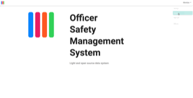

# OSMS
Data system for operational risk and safety information.

Project currently under development at Environment and Climate Change Canada under the Chief Data Office with the Enforcement Branch.

# Demo



## Installation

This application is using the Django framework. A conda environment was used.
Suggested setup:

1. Create a conda environment using the django_emv.yml file
2. Git clone the project and go to its folder.
3. Install postgresql and postgis.
4. Create a database and add the postgis extension.
5. Django secret key, Mapbox token and Algolia places account required (free)
6. Create a Django secret key in python:
```
  from django.core.management.utils import get_random_secret_key
  get_random_secret_key()
```
7. Create file `dev_secrets.json` in OSMS/OSMS/ and it needs to contain these keys:
```
    {
      "SECRET_KEY": "<Django secret key>",
      "DB_NAME": "<name of postgresql database",
      "DB_USER": "<postgresql username>",
      "DB_PASSWORD": "postgresql password",
      "MAPBOX_TOKEN": "a Mapbox API token",
      "ALGOLIA_PLACES_ID": "Algolia places ID",
      "ALGOLIA_PLACES_KEY": "Algolia places key"
    }

```
3. Run `python manage.py makemigrations` and then `python manage.py migrate` to create the tables.
4. You can create a superuser with `python manage.py createsuperuser` (when asked for a branch, enter "Other").
